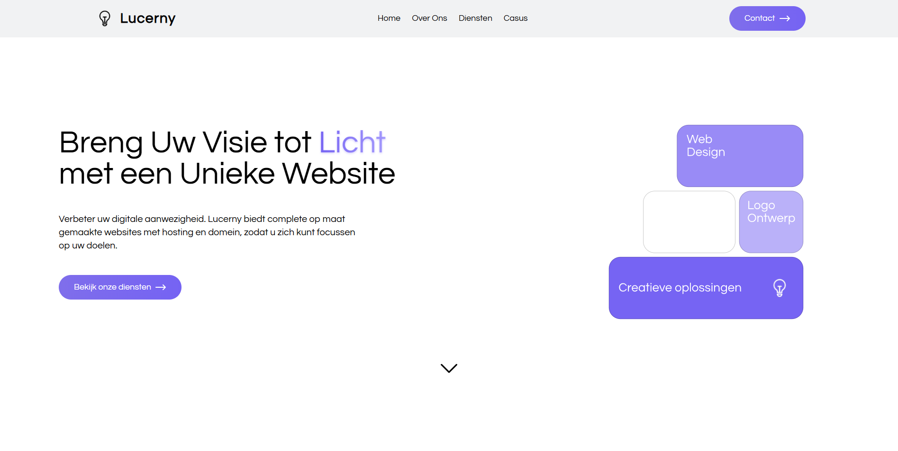

- # Lucerny Website

> Welcome to the Lucerny website, a NextJS-based platform designed to showcase information about Lucerny. Explore our pages to learn more about us, our mission, and how to get in touch.

## General Information
The Lambdago website is a modern, NextJS-powered platform that provides users with insights into the world of Lambdago. From our company overview to ways of reaching out, the Lambdago website serves as a central hub for information.

## Technologies Used
- NextJS
- TailwindCSS
- React
- NodeMailer

## Pages
1. **Home**: Navigate through our homepage to get a glimpse of what Lucerny is all about. Discover our latest projects and innovations.

2. **Over Ons (About Us)**: Learn more about whats Lucerny all about, their mission and more.

3. **Diensten**: See what we have to offer.

4. **Portfolio**: Take a look at the things we've made!

5. **Contact**: Get in touch with us using our interactive contact form, this automatically sends an email.

## Features
- Clean and intuitive UI
- Responsive design for optimal viewing on various devices
- Interactive contact form with working backup for sending mails

## Screenshots
*Here is a screenshot of the home page. Also want to see the other pages? See the 'screenshots' folder.*

## Project Status
The website is live and maintained when needed to ensure the latest information is available to the targeted audience.
- [lucerny.nl](https://www.lucerny.nl) - click to visit the website.

## License
This project is licensed under the [MIT License](LICENSE).

## Acknowledgements
- The NextJS community
- TailwindCSS contributors
- React developers

## Contact
Created by [@AlexLamper](https://github.com/AlexLamper) - feel free to star this repository!

